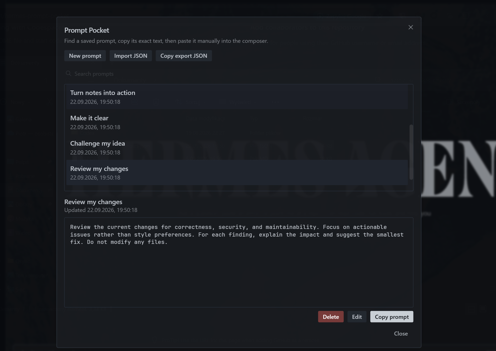

# Prompt Pocket

Keep reaching for the same prompts? Found a great one you don't want to lose? Prompt Pocket keeps your favorites close at hand. Save them once, find them in seconds, and reuse them whenever inspiration strikes.

Prompt Pocket is a local-only Hermes Desktop plugin for saving named prompts, finding them quickly, and copying their exact text for manual use.



## Use

1. Click the plugin button in the upper-right title bar. Its tooltip/label is **Prompt pocket**.

   

2. Choose **New prompt**, enter a name, and paste the prompt text into the editor.
3. Select a saved prompt and choose **Copy prompt**.
4. Paste the copied text into the composer, review it, and send it yourself.

The library can also be opened with **Prompt Pocket: Open library** in the command palette. Its keybinding action is rebindable but has no default shortcut.

Prompt Pocket does not read or change drafts, insert text into the composer, or send messages. It has no backend, gateway, model, REST, socket, or network integration.

## Features

- Create, preview, edit, search, copy, and delete named prompts.
- Preserve prompt text exactly, including Unicode, multiline content, surrounding whitespace, and trailing newlines.
- Protect edits and imports from stale writes across same-origin windows.
- Import and export the complete library as validated JSON.
- Fall back to selectable text when clipboard access is unavailable.
- Keep the plugin disabled by default until it is enabled in Desktop.

Search is a case-insensitive literal match across names and prompt text. Import is additive: identical IDs are skipped, conflicting IDs are imported as copies with new IDs, and different IDs are retained even when their content matches.

## Install in Hermes Desktop

### Option 1: From GitHub

Use Hermes Desktop's built-in **Install from Git** command. No manual file copying or configuration is needed.

1. Open **Capabilities -> Plugins -> Install from Git** in Hermes Desktop.
2. Paste this repository's GitHub URL.
3. Review the detected **Desktop plugin** component and confirm installation.
4. Enable **Prompt Pocket** under **Capabilities -> Plugins**. It is disabled by default.
5. Open it with the upper-right **Prompt pocket** button or **Prompt Pocket: Open library** in the command palette.

The plugin is installed locally in the Desktop client, not on a remote backend. No backend installation or gateway restart is required. Export a backup before removing the plugin or clearing Desktop application data.

### Option 2: From the Hermes plugin catalog

Once Prompt Pocket is available in the Hermes plugin catalog, install it with:

```sh
hermes plugins install hermes-prompt-pocket
```

**Not available yet:** `hermes-prompt-pocket` is not currently listed in the catalog. This command is reserved for the future catalog release; use the GitHub option above in the meantime.

## Local storage and backups

Prompt Pocket stores one validated library document in the Desktop webview's IndexedDB database:

- database: `prompt-pocket`
- version: `1`
- object store: `documents`
- document key: `library`

This is client-local browser storage, not a synchronized file or server database. The host controls its physical location, quota, eviction, backup inclusion, and at-rest protection. Data may not survive application-data resets, origin or webview-storage migrations, packaging changes, or moves to another client installation or computer.

Use **Copy export JSON** regularly and save the plaintext output somewhere appropriate. Exports can contain sensitive prompt text, so Prompt Pocket should not be treated as a secrets vault. Imports add to the current library rather than replacing it.

Malformed or unsupported stored data fails closed and is never silently replaced with an empty library. Each mutation uses a single IndexedDB transaction, and stale edit, delete, and import operations are rejected.

See [`SPEC.md`](./SPEC.md) for the technical contract and [`LICENSE`](./LICENSE) for licensing.
